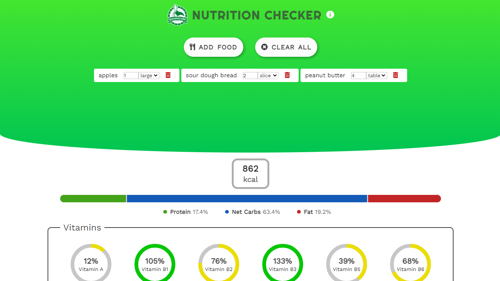

# Responsive nutrition checker application.

A website application that utilises Vue.js and the spoonacular API to display nutritional information on selected food. 
Made as a project for a persoanl portfolio.

<a href="https://peaceful-jennings-48cc85.netlify.app/" target="_blank">Demo</a>

## Features

<ul>
  <li> Search and select from a range of food options provided by Spoonacular API with autocomplete suggestions.</li>
  <li> Reponsive design, allowing for a formatted and easy to use layout on all screen sizes.</li>
  <li> Add, update or delete food entries and get instant nutritional information. </li>
  <li> Select individual food entries to get filtered nutritional information.</li>
</ul>

## Libraries and Technologies
<ul>
  <li> Accesses Spoonacular API for food and nutrition information.</li>
  <li> Uses Vue3. </li>
  <li> Implements Vue.js component stylings. </li>
  <li> Uses icons from Font Awesome.</li>
</ul>

## Attribution
This project uses the SPoonacular API but is not endorsed or certified by Spoonacular.

